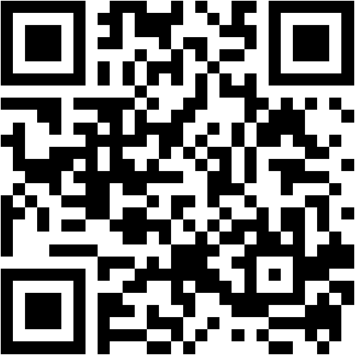

# かぜ診療トレーニング

初期研修医(1〜2年目)向けの、外来でよくある「かぜ」症状の患者さんを疑似体験できるトレーニングアプリです。

## 公開ページ

**https://namazu1995-coder.github.io/kaze-training/**



スマートフォンで上記QRコードを読み取ると、そのままアプリを開けます。

## このアプリについて

かぜ診療の教育的な価値は、不確実さが残る中で必要十分な診療を行い、患者さんが安心して帰宅・療養できるようにする力を学べることにあります。本アプリは、その診療を次の3つの軸に整理して練習します。

1. レッドフラッグがないか(重症感・呼吸状態・バイタルサイン・患者背景を確認し、見逃したくない疾患を考える)
2. 抗菌薬が必要か(「かぜだから不要」で終わらず、抗菌薬を要する所見や検査で方針が変わるかを考える)
3. どう説明するか(受診理由・不安を確認し、見立て・抗菌薬の要否・対症療法・予想される経過・再受診の目安を共有する)

外来受診6症例(レッドフラッグを見抜く症例2例、抗菌薬の要否を判断する症例4例)を収録しています。各症例では、模範解答を見る前に上記3つの軸を自分の言葉で書き出してから、具体的な薬剤量・スコアリング基準(A-DROP、Centor/McIsaac基準など)や日本国内の処方事情を含む模範解答と「症例のまとめ」、実在のガイドライン・論文の参考文献を確認できます。

進捗はブラウザのlocalStorageに保存され、自己評価に応じて復習リストが作成されます。

症例に加えて、「かぜ診療の3つの軸」の解説ページと、「対症療法について理解を深める」ページも収録しています。後者は、①いちばん困っている症状は何か→②その治療にどれくらい効果を期待できるか→③その患者にとって不利益はないか→④薬が必要か・いつまで使うか、という順番で対症療法を考える枠組みと、症状別の具体的な処方例(用法用量・エビデンスの程度・不利益・使用期間の目安)をまとめています。

## 収録症例

**レッドフラッグを見抜く症例**
- 市中肺炎(かぜと思われていた高齢者)
- 扁桃周囲膿瘍

**抗菌薬の要否を判断する症例**
- ウイルス性上気道炎(基本形)
- A群溶血性連鎖球菌咽頭炎の疑い
- 急性細菌性副鼻腔炎の疑い
- 抗菌薬を強く希望する軽症例(患者対応・説明)

## 編集方法

`index.html` 1ファイルで完結するVanilla JSアプリです。クローンして編集し、`main`ブランチにpushするとGitHub Pagesへ自動反映されます。

```bash
git clone https://github.com/namazu1995-coder/kaze-training.git
```
